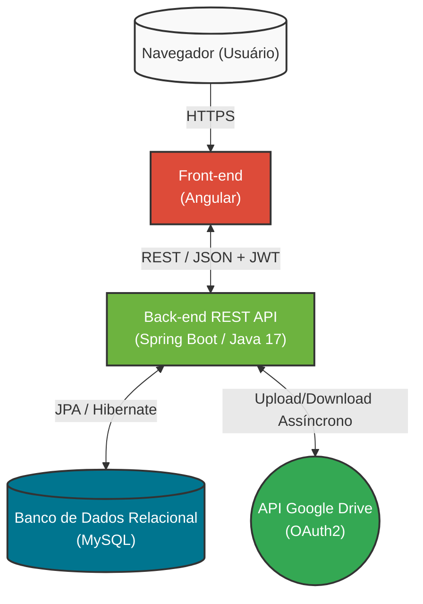
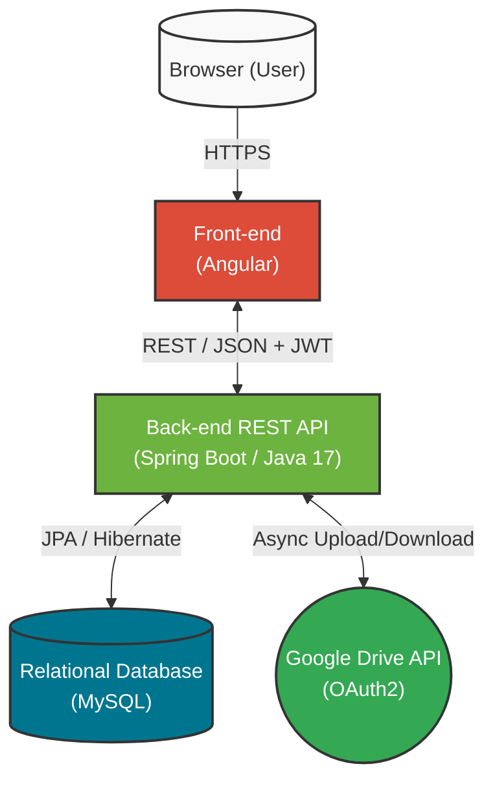

# Portfólio de Desenvolvimento Backend
🌎 *[Click here for the English version / Clique aqui para a versão em inglês](#english-version)*

## 1. Visão Geral e Metodologia

O projeto consiste no desenvolvimento de um sistema web para automatizar a geração, o envio e a gestão de relatórios anuais de Pesquisa e Desenvolvimento (P&D) exigidos pela SUFRAMA para empresas instaladas na Zona Franca de Manaus.

A aplicação adota uma arquitetura baseada em microsserviços lógicos, utilizando **Angular** (TypeScript) no front-end e **Spring Boot** (Java) no back-end. A estrutura do código da API baseia-se em uma organização orientada a *features* (por exemplo, o pacote `usuario` encapsula seus próprios controladores, serviços, repositórios e modelos). Essa decisão favoreceu a coesão sem a rigidez e a complexidade de um *Domain-Driven Design (DDD)* estrito, provando-se ideal para o escopo e a necessidade de escalabilidade da equipe.

Durante o desenvolvimento, utilizamos a metodologia ágil **SCRUM**, que permitiu entregas iterativas e constante validação com as necessidades de negócio do cliente. Atuei ativamente não apenas na escrita de código, mas também na modelagem de requisitos e na concepção da arquitetura inicial, aprendendo a equilibrar padrões rígidos de engenharia de software com entregas ágeis e prazos reais.

## 2. Arquitetura e Decisões

Para garantir separação de responsabilidades e viabilizar o fluxo de deploy automatizado, o sistema foi desenhado com um back-end *stateless*, um banco de dados relacional e a delegação do armazenamento de arquivos de evidências diretamente para nuvem.



## 3. Destaque Técnico 1: Integração Assíncrona e Resiliente (Google Drive)

**O Desafio:**
O sistema exige a organização centralizada de evidências de atividades (arquivos, planilhas, PDFs). Era necessário gerar hierarquias de pastas completas (`Projeto > Atividade > Subatividade`) e realizar o upload de múltiplos arquivos pesados. Fazer isso de forma síncrona bloqueava a *thread* HTTP principal, o que gerava *timeouts* de requisição e prejudicava drasticamente a experiência do usuário na interface.

**A Solução:**
Desenvolvemos uma integração utilizando a API do Google Drive com autenticação fluída baseada em OAuth2 e Refresh Tokens. O gargalo de performance foi solucionado aplicando o modelo assíncrono (`@Async` no Spring Boot), empurrando os *uploads* e criação de pastas para *threads* em *background*.

Além disso, implementamos um padrão de *Retry* com *Backoff Exponencial* para lidar com falhas temporárias de rede (ex: SocketTimeoutException) ou instabilidades da API do Google (Erros HTTP 5xx), garantindo a consistência das referências salvas no banco de dados.

**Snippet (Higienizado):**

```java
@Service
public class GoogleDriveService {
    
    // Configurações, injeção de dependências e logger...

    @Async
    @Transactional
    public void uploadEvidenciaAsync(
        Long evidenciaId, String refreshToken, String pastaSubAtividadeId, 
        String nomeArquivo, String mimeType, byte[] fileContent
    ) {
        try {
            final String operacaoNome = "Upload Evidência ID: " + evidenciaId;
            
            // Método utilitário que engloba retentativas (retry pattern) e backoff exponencial
            String driveFileId = executarComRetry(() -> {
                Drive driveClient = getDriveService(refreshToken); 
                
                File fileMetadata = new File();
                fileMetadata.setName(nomeArquivo);
                fileMetadata.setParents(Collections.singletonList(pastaSubAtividadeId)); 
                
                ByteArrayContent mediaContent = new ByteArrayContent(mimeType, fileContent);
                
                File file = driveClient.files().create(fileMetadata, mediaContent)
                    .setFields("id, webContentLink, webViewLink")
                    .execute();
                    
                return file.getId();
            }, operacaoNome);
            
            // Persistência: só acontece se os retries do drive forem bem-sucedidos
            Evidencia evidencia = evidenciaRepository.findById(evidenciaId).orElse(null);
            if (evidencia != null) {
                evidencia.setDriveFileId(driveFileId); 
                evidenciaRepository.save(evidencia); 
                logger.info("Upload de Evidência {} concluído com sucesso no Drive.", evidenciaId);
            }
                
        } catch (Exception e) {
            // Logamos para que uma rotina de monitoramento saiba quais uploads falharam
            logger.error("Falha crítica (irreversível após retries) no upload: {}", e.getMessage());
        }
    }
}
```

## 4. Destaque Técnico 2: Isolamento de Contexto (Multi-Tenancy)

**O Desafio:**
O sistema atua com um escopo forte de multi-tenancy a nível de Projetos. Um único usuário pode atuar em dezenas de projetos, assumindo funções e permissões distintas em cada um (ex: Gestor no Projeto A e Leitor no Projeto B). Exigir o tráfego do `projectId` como parâmetro em todas as rotas *REST* criava poluição visual no código, além de representar uma grande falha potencial de Insecure Direct Object Reference (IDOR) caso validações fossem esquecidas.

**A Solução:**
Desenvolvemos um fluxo de **Token de Contexto (JWT Customizado)**. O usuário faz o login primário e obtém uma lista de seus projetos. Ao selecionar um, ele emite uma requisição que retorna um novo JWT de acesso limitado. 

Este novo token possui as *claims* injetadas relativas apenas àquele projeto (`projeto_id`, `funcao_id`, e lista de `permissoesLocais`). Assim, o back-end sabe o contexto por natureza da autenticação. Implementamos uma classe utilitária de intercepção que fica responsável por abstrair essas *claims* diretamente do contexto do Spring Security, garantindo segurança a nível de arquitetura.

**Snippet (Higienizado):**

```java
@Component
public class ContextoAutenticado {

    // Lê o JWT extraído e decodificado pelo Filtro do Spring Security
    private DecodedJWT getJwtToken() {
        Authentication autenticacao = SecurityContextHolder.getContext().getAuthentication();

        if (autenticacao == null || autenticacao.getDetails() == null) {
            throw new IllegalStateException("Usuário não autenticado ou token JWT ausente.");
        }

        return (DecodedJWT) autenticacao.getDetails();
    }
    
    public Long getProjetoId() {
        return getJwtToken().getClaim("projeto_id").asLong();
    }

    public List<String> getPermissoesLocais() {
        List<String> permissoesLocais = getJwtToken().getClaim("permissoesLocais").asList(String.class);
        return permissoesLocais != null ? permissoesLocais : List.of();
    }

    /**
     * Utilizado internamente nas camadas de serviço para validar autorização.
     * Caso o usuário não tenha o papel exigido, o fluxo HTTP aborta imediatamente.
     */
    public void exigirPermissao(String permissao) {
        if (!getPermissoesLocais().contains(permissao)) {
            throw new AccessDeniedException("Acesso negado. Permissão local necessária: " + permissao);
        }
    }
}
```

## 5. Deploy e CI/CD

Com o objetivo de diminuir a defasagem entre o ambiente de desenvolvimento e o ambiente de produção (o famoso *"na minha máquina funciona"*), a aplicação está estritamente conteinerizada com **Docker**.

A estrutura do `Dockerfile` utiliza uma abordagem de *Multi-Stage Build* nativa do Maven com Java Alpine, garantindo uma imagem final limpa (com apenas a JRE e o `.jar` compilado) e segura.

Nosso fluxo de **CI/CD** foi estabelecido utilizando *workflows* automatizados do **GitHub Actions**. Para orquestração e deploy contínuo em servidor de produção, usamos o **Dockploy**, que garante que assim que o código atinge as ramificações de qualidade estabelecidas, os contêineres sejam re-disponibilizados na infraestrutura do cliente sem instabilidade ou *downtimes* perceptíveis (*zero-downtime deployment* em essência).

<br>
<hr>
<br>

<a name="english-version"></a>
🇧🇷 *[Clique aqui para voltar para a versão em Português](#portfólio-de-desenvolvimento-backend)*

# Backend Development Portfolio

## 1. Overview and Methodology

The project consists of developing a web system to automate the generation, submission, and management of annual Research and Development (R&D) reports required by SUFRAMA for companies located in the Manaus Free Trade Zone.

The application adopts a logical microservices-based architecture, using **Angular** (TypeScript) on the front-end and **Spring Boot** (Java) on the back-end. The API code structure is based on a feature-oriented organization (e.g., the `usuario` package encapsulates its own controllers, services, repositories, and models). This decision promoted cohesion without the rigidity and complexity of a strict *Domain-Driven Design (DDD)*, proving ideal for the project's scope and the team's scalability needs.

During development, we used the **SCRUM** agile methodology, allowing iterative deliveries and constant validation with the client's business needs. I actively participated not only in writing code but also in requirements modeling and the initial architecture design, learning how to balance strict software engineering standards with agile deliveries and real-world deadlines.

## 2. Architecture and Decisions

To ensure separation of concerns and enable an automated deployment flow, the system was designed with a *stateless* back-end, a relational database, and the delegation of evidence file storage directly to the cloud.



## 3. Technical Highlight 1: Async and Resilient Integration (Google Drive)

**The Challenge:**
The system requires the centralized organization of activity evidence (files, spreadsheets, PDFs). It was necessary to generate complete folder hierarchies (`Project > Activity > Subactivity`) and upload multiple heavy files. Doing this synchronously blocked the main HTTP thread, causing request timeouts and drastically degrading the user experience on the interface.

**The Solution:**
We developed an integration using the Google Drive API with fluid OAuth2 and Refresh Token-based authentication. The performance bottleneck was solved by applying the asynchronous model (`@Async` in Spring Boot), pushing uploads and folder creations to background threads.

Additionally, we implemented a *Retry* pattern with *Exponential Backoff* to handle temporary network failures (e.g., SocketTimeoutException) or Google API instabilities (HTTP 5xx Errors), ensuring the consistency of references saved in the database.

**Snippet (Sanitized):**

```java
@Service
public class GoogleDriveService {
    
    // Configurations, dependency injections, and logger...

    @Async
    @Transactional
    public void uploadEvidenciaAsync(
        Long evidenciaId, String refreshToken, String pastaSubAtividadeId, 
        String nomeArquivo, String mimeType, byte[] fileContent
    ) {
        try {
            final String operacaoNome = "Upload Evidence ID: " + evidenciaId;
            
            // Utility method that encapsulates retries (retry pattern) and exponential backoff
            String driveFileId = executarComRetry(() -> {
                Drive driveClient = getDriveService(refreshToken); 
                
                File fileMetadata = new File();
                fileMetadata.setName(nomeArquivo);
                fileMetadata.setParents(Collections.singletonList(pastaSubAtividadeId)); 
                
                ByteArrayContent mediaContent = new ByteArrayContent(mimeType, fileContent);
                
                File file = driveClient.files().create(fileMetadata, mediaContent)
                    .setFields("id, webContentLink, webViewLink")
                    .execute();
                    
                return file.getId();
            }, operacaoNome);
            
            // Persistence: only happens if drive retries are successful
            Evidencia evidencia = evidenciaRepository.findById(evidenciaId).orElse(null);
            if (evidencia != null) {
                evidencia.setDriveFileId(driveFileId); 
                evidenciaRepository.save(evidencia); 
                logger.info("Upload of Evidence {} completed successfully on Drive.", evidenciaId);
            }
                
        } catch (Exception e) {
            // Logged so a monitoring routine knows which uploads failed
            logger.error("Critical failure (irreversible after retries) on upload: {}", e.getMessage());
        }
    }
}
```

## 4. Technical Highlight 2: Context Isolation (Multi-Tenancy)

**The Challenge:**
The system operates with a strong multi-tenancy scope at the Project level. A single user can participate in dozens of projects, assuming different roles and permissions in each (e.g., Manager in Project A and Reader in Project B). Requiring the `projectId` to be passed as a parameter in all *REST* routes created visual clutter in the code, and posed a major potential Insecure Direct Object Reference (IDOR) flaw if validations were missed.

**The Solution:**
We developed a **Context Token (Custom JWT)** flow. The user performs the primary login and retrieves a list of their projects. Upon selecting one, they issue a request that returns a new, limited-access JWT.

This new token has injected claims related only to that specific project (`projeto_id`, `funcao_id`, and a list of `permissoesLocais`). Thus, the back-end inherently knows the context through authentication. We implemented an interception utility class responsible for extracting these claims directly from the Spring Security context, ensuring architectural-level security.

**Snippet (Sanitized):**

```java
@Component
public class ContextoAutenticado {

    // Reads the JWT extracted and decoded by the Spring Security Filter
    private DecodedJWT getJwtToken() {
        Authentication autenticacao = SecurityContextHolder.getContext().getAuthentication();

        if (autenticacao == null || autenticacao.getDetails() == null) {
            throw new IllegalStateException("User not authenticated or missing JWT token.");
        }

        return (DecodedJWT) autenticacao.getDetails();
    }
    
    public Long getProjetoId() {
        return getJwtToken().getClaim("projeto_id").asLong();
    }

    public List<String> getPermissoesLocais() {
        List<String> permissoesLocais = getJwtToken().getClaim("permissoesLocais").asList(String.class);
        return permissoesLocais != null ? permissoesLocais : List.of();
    }

    /**
     * Used internally in service layers to validate authorization.
     * If the user doesn't have the required role, the HTTP flow aborts immediately.
     */
    public void exigirPermissao(String permissao) {
        if (!getPermissoesLocais().contains(permissao)) {
            throw new AccessDeniedException("Access denied. Required local permission: " + permissao);
        }
    }
}
```

## 5. Deployment and CI/CD

Aiming to reduce the gap between the development environment and the production environment (the famous *"it works on my machine"* issue), the application is strictly containerized using **Docker**.

The `Dockerfile` structure uses a native Maven *Multi-Stage Build* approach with Java Alpine, ensuring a clean (containing only the JRE and the compiled `.jar`) and secure final image.

Our **CI/CD** workflow was established using automated **GitHub Actions** workflows. For orchestration and continuous deployment on the production server, we use **Dockploy**, which ensures that as soon as the code meets the established quality branches, the containers are automatically re-deployed in the client's infrastructure without instability or noticeable downtimes (essentially *zero-downtime deployment*).
